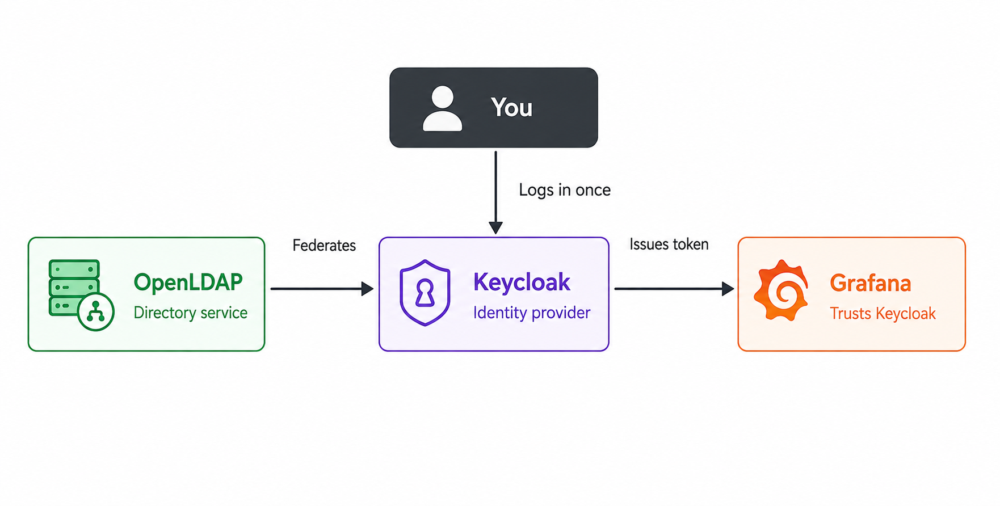

# LDAP + Keycloak + Grafana SSO Lab

A hands-on lab building a full Single Sign-On stack from scratch: a real OpenLDAP
directory service, Keycloak as an Identity Provider federated against it, and
Grafana as a client application trusting Keycloak instead of managing its own logins.

Built while studying CompTIA Security+ (SSO, SAML, federation, directory services).

## Architecture

- **OpenLDAP** — directory service, holds real user accounts (Homer, Marge, Bart, Lisa)
- **Keycloak** — Identity Provider, federated against OpenLDAP via LDAP (read-only)
- **Grafana** — application client, trusts Keycloak instead of storing its own users

## What's in this repo

- `ldap/` — LDIF files used to populate the directory (users, groups)
- `keycloak/run.sh` — Docker command to launch Keycloak
- `grafana/run.sh` — Docker command to launch Grafana, configured for OIDC login via Keycloak
- `docs/` — architecture diagram

## How it works

1. OpenLDAP holds the real user accounts and password hashes
2. Keycloak is configured with LDAP User Federation (read-only), so it authenticates
   users by querying OpenLDAP directly rather than storing credentials itself
3. Grafana is registered as an OpenID Connect client in Keycloak
4. Logging into Grafana redirects to Keycloak, which binds/searches against OpenLDAP
   to verify the user, then issues a signed token back to Grafana
5. A second login to any other Keycloak-connected app reuses the existing session —
   no second login prompt. That's the actual SSO payoff.

## Real issues hit and fixed along the way

- `host.docker.internal` doesn't resolve inside containers on native Linux Docker
  the way it does on Docker Desktop — fixed by using the Docker bridge IP
  (`ip addr show docker0`) directly in place of the hostname
- A silent LDAP sync returning 0 users traced back to an incorrect **Users DN**
  field in Keycloak's federation settings, not a connectivity problem
- A `docker run` command with an unsubstituted placeholder in
  `CLIENT_SECRET` produced a misleading `unauthorized_client` OAuth error —
  looked like a credentials bug, was actually a copy-paste miss
- Accidentally built the entire LDAP federation and Grafana client inside
  Keycloak's `master` realm instead of a dedicated realm, causing a confusing
  404 on login rather than an obvious permissions error

## Setup (for reference)

Requires Docker and an OpenLDAP server (`slapd`) already running with the LDIF
files in `ldap/` applied.

\`\`\`bash
bash keycloak/run.sh
bash grafana/run.sh
\`\`\`

Then configure Keycloak's LDAP User Federation and the Grafana OIDC client
through the admin console, pointing at your OpenLDAP instance.# LDAP + Keycloak + Grafana SSO Lab
